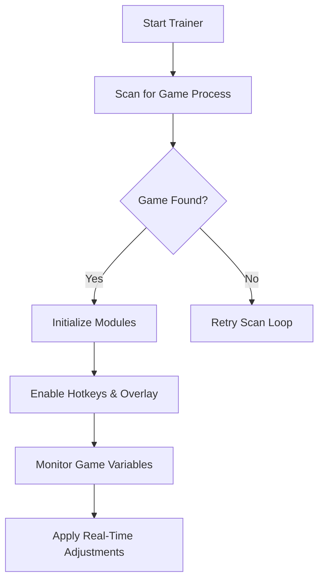

## Overview

The **Perfect Tower II Trainer** is a feature-rich **single-player enhancement utility** designed to accelerate progression, automate repetitive tasks, optimize resource generation, and give players deeper control over combat, factories, and research flow.

Built atop a modular memory-mapped architecture, the trainer delivers stable, real-time edits while preserving the game’s strategic core.

[!IMPORTANT]
All features are **offline-only** and do not affect multiplayer or shared servers.

---

## Features

### 💎 Resource Amplification Suite

Supercharge your progression with controlled boosts:

* infinite cubes (white/black/color tiers)
* auto-increment multipliers
* unlimited credits & research points
* customizable production multipliers
* storage cap override

Each modifier is adjustable via sliders for balanced or extreme pacing.

---

### ⚙️ Factory & Automation Tools

Reduce grind and strengthen efficiency:

* instant factory cycles
* auto-refine mode
* unlimited machine durability
* upgrade-all button override
* blueprint cost nullifier

Perfect for mid-to-late game factory optimization.

---

### 🛡 Combat & Tower Enhancements

Dominate waves with precision tools:

* infinite HP
* infinite energy
* instant ability cooldowns
* damage multiplier curve
* auto-wave advance toggle

Designed to help you test builds, strategies, or simply relax through difficult waves.

---

### 🧪 Research & Lab Expansion Tools

Speed through progression layers:

* free research
* instant lab completion
* auto-unlock tech tree nodes
* no material cost mode

Great for experimenting with high-tier combinations.

---

### 📈 Incremental Buffs & Curves

Shape your game’s pacing:

* XP multipliers
* cube income curves
* wave scaling modifiers
* global speed curve

These allow smooth, natural-feeling progression rather than sudden jumps.

---

### 🧩 Profile Presets

Switch instantly between custom loadouts:

* idle farming profile
* combat testing profile
* completionist profile
* experimental sandbox

Profiles save automatically for seamless transitions.

---

## Compatibility

| Platform            | Support | Notes                             |
| ------------------- | ------- | --------------------------------- |
| Windows 10/11       | ✔️      | Fully supported                   |
| Steam Release       | ✔️      | Auto-detected                     |
| Browser Version     | ⚠️      | Partial, requires injected loader |
| Linux (Proton)      | ⚠️      | Core features operational         |
| Multiplayer Servers | ❌       | Not supported or allowed          |

*Accessibility note:* UI supports font scaling, color-safe designs, and hotkey-only control.

---

## Setup ⚡

1. **Download The Perfect Tower II Trainer**
   Extract into a clean folder.

2. **Launch the Trainer**
   It will automatically detect the game window or process.

3. **Start the Game**
   Load your save or begin fresh.

4. **Activate modules using the overlay or hotkeys**
   Features toggle in real time.

5. **Customize**
   Adjust multipliers, resource curves, or automation patterns to match your preferred pacing.

### Example Hotkeys

```plaintext
F1 — Infinite Health  
F2 — Infinite Energy  
F3 — Add 1M Cubes  
F4 — Instant Factory Cycle  
F5 — Wave Auto-Advance  
F6 — XP Multiplier
```

---

## Mermaid Diagram — Trainer Workflow



---

## Advanced Capabilities

### 🔬 Memory-Safe Incremental Hooks

Stable, version-adaptive hooks that minimize crashes during:

* rapid factory cycles
* heavy combat waves
* large simultaneous updates

### 🎚 Custom Multipliers & Curves

```json
{
  "cube_multiplier": 10,
  "xp_multiplier": 4,
  "factory_speed_curve": "ease_in_out",
  "damage_curve": "exponential"
}
```

### 🧠 AI & Wave Logic Controls

Perfect for build testing:

* forced wave type
* spawn density override
* weakened enemy scaling for simulations

### 🗃 SaveGuard Backups

Automatic backup creation before persistent modifications.

[!NOTE]
Persistent edits require explicit opt-in for safety.

---

## Example Config Profile

```json
{
  "profile": "infinite_labyrinth",
  "resources": {
    "cube_multiplier": 25,
    "credit_multiplier": 10
  },
  "combat": {
    "infinite_hp": true,
    "damage_multiplier": 5,
    "auto_advance": true
  },
  "factory": {
    "instant_cycles": true,
    "durability_infinite": true
  }
}
```

---

## FAQ

### **Does the trainer affect multiplayer?**

No—trainer features do not function on multiplayer servers.

### **Will it damage my save file?**

Runtime modifications are safe. Persistent edits trigger SaveGuard backups.

### **Do updates break the trainer?**

Minor updates are usually handled automatically. Major updates may require an offset patch.

### **Can I use this with mods?**

Yes—visual or quality-of-life mods are typically compatible.

### **Can I remap hotkeys?**

Absolutely—every key is customizable.

---

## Final Thoughts

*The Perfect Tower II* thrives on progression, optimization, and the joy of watching numbers bloom into empires.
This trainer doesn’t replace that joy—it amplifies it, giving you the freedom to experiment, optimize, explore, and accelerate your strategies without grinding.

Whether you seek a relaxed idle experience, a hyper-optimized factory run, or a sandbox of limitless cubes, the trainer stands ready—precise, stable, and endlessly adaptable.

